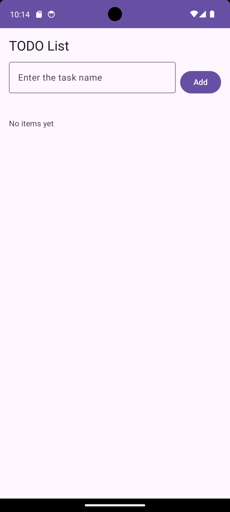
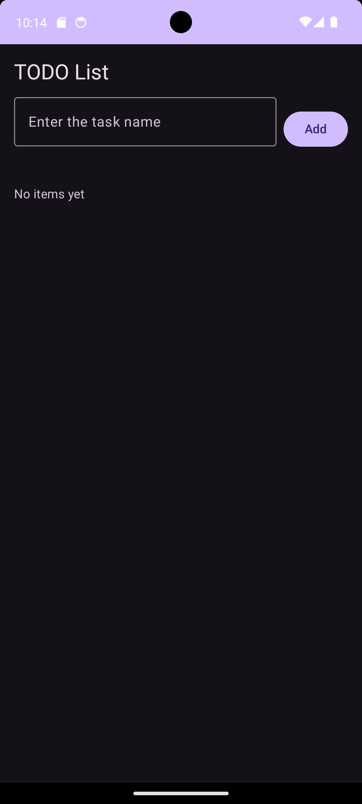
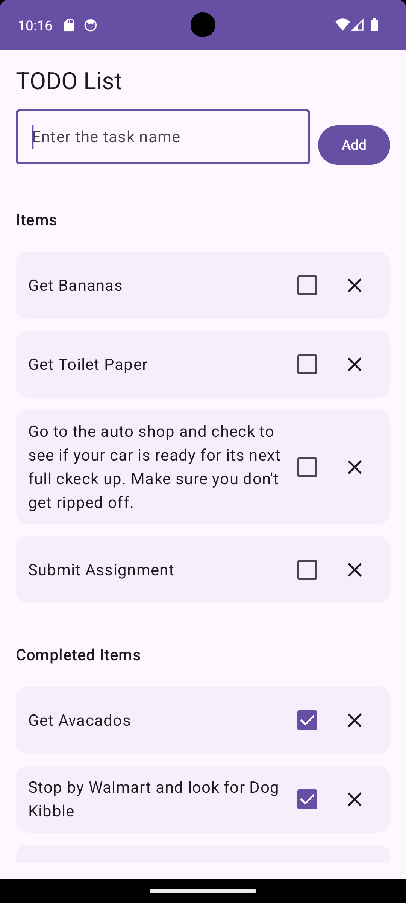
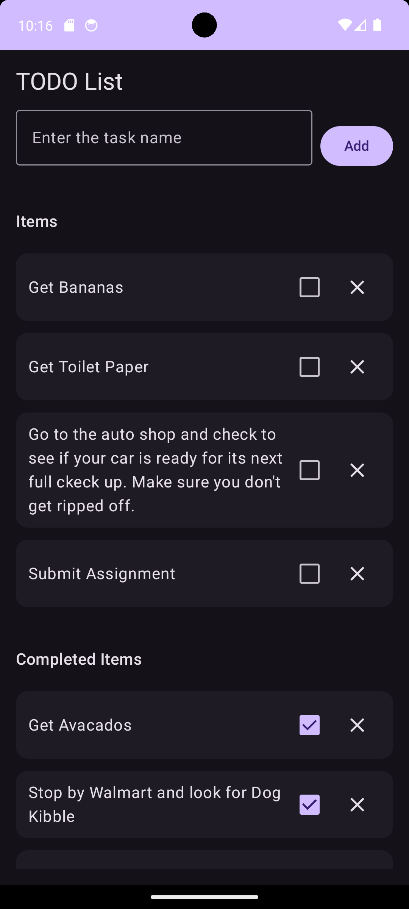

# Todoapp (Jetpack Compose • Kotlin)

A simple, beginner-friendly To-Do app built for CPSC 411A. It demonstrates data classes, state with `remember/rememberSaveable`, state hoisting, and a clean unidirectional data flow using Jetpack Compose + Material 3. The UI supports light/dark mode and basic accessibility.

## Screenshots

| Light                                                           | Dark                                                                 |
|-----------------------------------------------------------------|----------------------------------------------------------------------|
|  |  |
|  |  |

## App Overview

Two sections:
- **Items** (active)
- **Completed Items**

You can add a task, toggle it complete/incomplete (moves between sections), and delete it. Blank input shows inline validation. State is preserved across configuration changes (e.g., rotation).

## Features (mapped to assignment)

- **Data model:** `TodoItem(id: Long, title: String, isDone: Boolean)`
- **State:** `mutableStateListOf` + `rememberSaveable` (with `listSaver`)
- **State hoisting:** Parent (`TodoApp`) holds state; UI composables get state + callbacks
- **Compose UI:** `Row/Column`, `OutlinedTextField`, `Button`, `Checkbox`, `IconButton`, `LazyColumn`
- **Recomposition:** Only updates affected items; stable keys in lists
- **Validation:** Trims whitespace; shows error for blank input
- **Sections & empty states:** Headers shown only when non-empty; friendly message otherwise
- **Persistence (session):** Survives rotation via `rememberSaveable`

## Tech Stack

- **Language:** Kotlin
- **UI:** Jetpack Compose (Material 3)
- **Min SDK:** 24
- **Compile/Target:** 34

## Concepts Used

- **Data class:** `TodoItem`
- **State:** `mutableStateListOf`, `remember`, `rememberSaveable`, `listSaver`
- **State hoisting:** Callbacks for add/toggle/delete passed to stateless composables
- **Unidirectional data flow:** Parent owns state; children emit events
- **Theming:** Material 3 with dark mode support (`onBackground`, `onSurfaceVariant`)

## Project Structure (key files)

app/
src/
main/
java/com/example/todoapp/
MainActivity.kt # UI + state hoisting
model/TodoItem.kt # data class
res/
layout/ (Compose uses code)
values/
AndroidManifest.xml


## How to Run

1. Open in **Android Studio** (latest).
2. Ensure an emulator/device is available.
3. Click **Run ▶**.
4. If the emulator fails to boot in Studio on Linux, launch manually:
   ```bash
   export QT_QPA_PLATFORM=xcb
   export QT_OPENGL=software
   export LIBGL_ALWAYS_SOFTWARE=1
   ~/Android/Sdk/emulator/emulator @Pixel_6a \
     -no-snapshot -no-boot-anim \
     -gpu swiftshader_indirect -accel on -verbose
